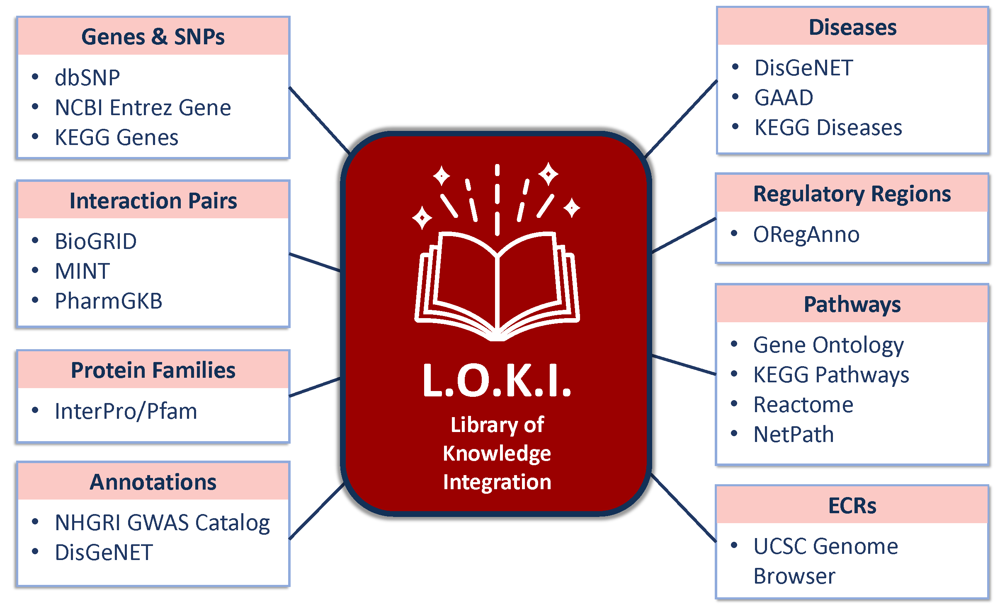

# Library of Knowledge Integration ('LOKI')
Rather than issuing queries in real-time to a series of external databases, Biofilter consults a local database called the **Library of Knowledge Integration**, or nicknamed **LOKI**. 

This LOKI section will guide a user through how to run the provided scripts, dynamically pull raw data from each external source, and build a LOKI SQLite database.

<!-- TODO Update with final LOKI figure -->

LOKI must be generated on the local system before Biofilter can be used, but because the resulting knowledge database is a single local file, Biofilter itself does not require an internet connection to run. 

The process of building LOKI requires a relatively large amount of time and disk space to complete, but only needs to be done once.
