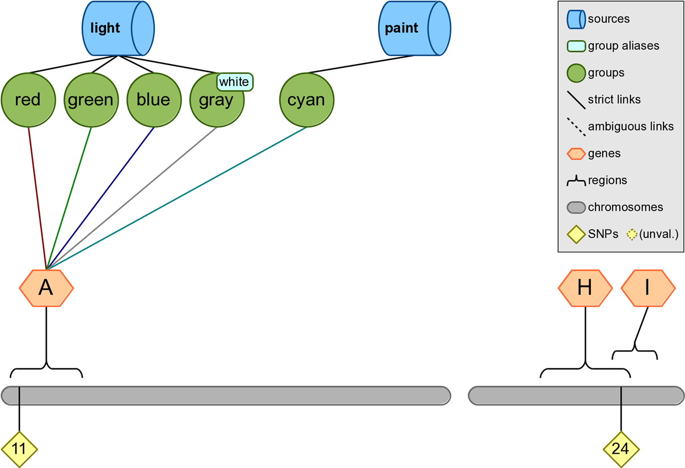

# Annotation Examples
## Example 1: Annotating a SNP with Gene Region Information



Configuration:
```
KNOWLEDGE test.db
SNP rs11 rs24 rs99
ANNOTATE snp region
```

Output:
```
#user_input     snp         chr         region      start       stop
rs11            rs11        1           A           8           22
rs24            rs24        2           H           22          42
rs24            rs24        2           I           38          48
rs99            rs99
```

## Example 2: Annotating SNPs with Location Information
A user can provide Biofilter with a list of SNPs as an input and map those SNPs to the corresponding chromosome and base pair location (if any) as shown in the example below.

Configuration:
```
KNOWLEDGE test.db
SNP rs11 rs24 rs99
ANNOTATE snp position
```

Output:
```
#user_input     snp         chr     position        pos
rs11            rs11        1       rs11            10
rs24            rs24        2       rs24            40
rs99            rs99
```

## Example 3: Map a SNP to the Groups and Sources Where the SNP is Present
Biofilter can be used to map a list of SNPs, or a single SNP, to the groups and sources where those SNPs are present. 

Configuration:
```
KNOWLEDGE test.db
SNP rs11 rs24 rs99
ANNOTATE snp group  source
```

Output:
```
#user_input     snp         group       source
rs11            rs11        red         light
rs11            rs11        green       light
rs11            rs11        blue        light
rs11            rs11        gray        light
rs11            rs11        cyan        paint
rs24            rs24            
rs99            rs99
```

## Example 4: Annotating a Base Pair Region with the List of SNPs in that Region
A region can be supplied to Biofilter, with an output of the SNPs known to be in that region. 

Configuration:
```
KNOWLEDGE test.db
REGION 1:1:60
ANNOTATE snp region
```

Output:
```
#user_input     snp         chr     region  start   stop
chr1:1-60       rs11        1       A       8       22
chr1:1-60       rs12        1       A       8       22 
chr1:1-60       rs13        1       B       28      52
chr1:1-60       rs14        1       B       28      52
chr1:1-60       rs15        1       B       28      52
chr1:1-60       rs15        1       C       52      62
chr1:1-60       rs16        1       C       54      62
chr1:1-60       rs16        1       D       58      72
```

