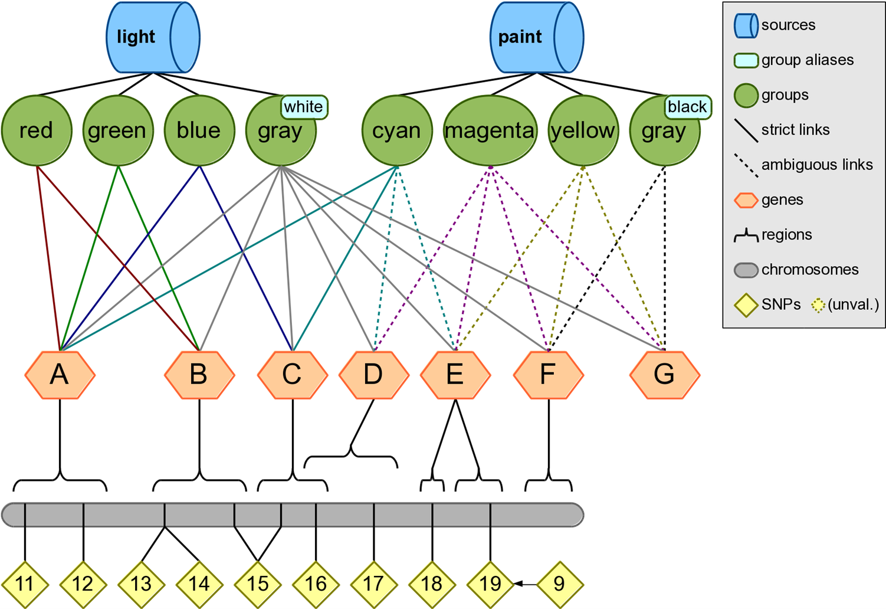
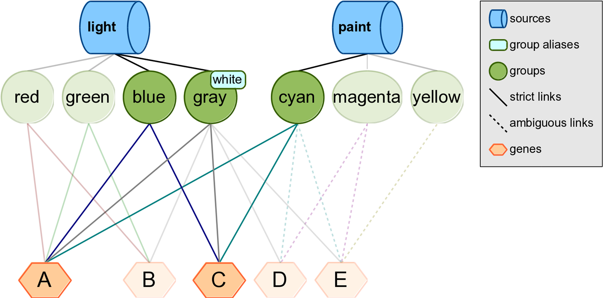
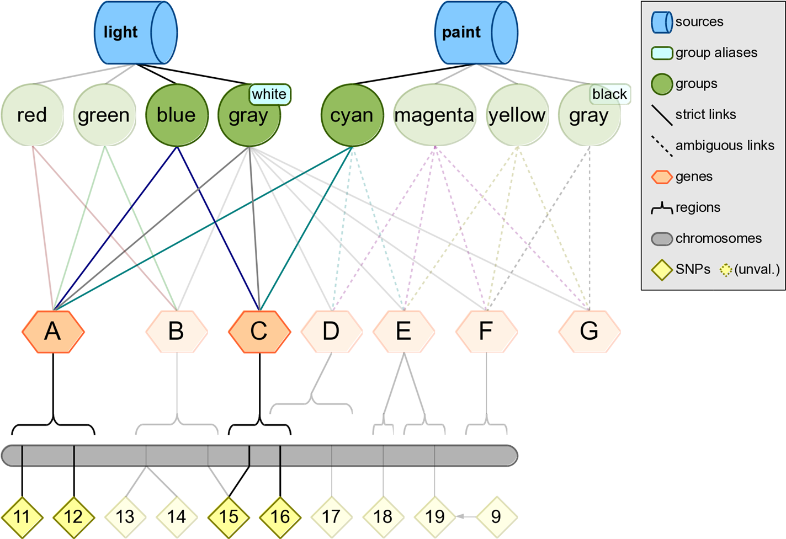

# Modeling Examples

Here we present an example with two sources and eight pathways, to explain how Biofilter can generate pairwise SNP-SNP and Gene-Gene models. In further sections we explain other options for how model generation can be performed in Biofilter.



## Step 1

Map the input list of SNPs to genes within Biofilter; for this example, we will use all of the SNPs on the first chromosome. Note that Gene F does not contain any SNPs.

Configuration:
```
KNOWLEDGE test.db
SNP 11 12 13 14 15 16 17 18 19
FILTER gene
```

Output:
```
#gene
A
B
C
D
E
```

## Step 2

Connect, pairwise, the genes that contain SNPs in the input list of SNPs.

Configuration:

```
KNOWLEDGE test.db
GENE A B C D E
MODEL gene
```
Output:

```
#gene1 gene2   score(src-grp)
A       C       2-3
```



Biofilter has determined that genes A and C are found together in three groups across two sources. In other words, both the light and paint sources contain groups—blue, gray, and cyan—that suggest a relationship between genes A and C.

This relationship is summarized by the implication score “2-3,” which gives the number of sources followed by the number of groups which support this gene model. Each time the same pairwise model of genes is found in another source, the left-hand index of the implication score for that pairwise model increases by one; each time it is found in another group from the same source, the right-hand index increases by one.

## Step 3
Break down the gene-gene models into all pairwise combinations of SNPs across the genes within sources light and paint.

Configuration:
```
KNOWLEDGE test.db
SOURCE light paint
MODEL snp
```

Output:
```
#snp1       snp2        score(src-grp)
rs11        rs15        2-3
rs11        rs16        2-3
rs12        rs15        2-3
rs12        rs16        2-3
```



# Biofilter Modeling

Although this three-step strategy will work in the Biofilter, the strategy can be simplified. Biofilter will automatically generate gene models prior to generating SNP models and there is no need to specify that step separately. It is possible to generate the SNP models with a single command.

Configuration:
```
KNOWLEDGE test.db
SNP 11 12 13 14 15 16 17 18 19
MODEL snp
```

Output:
```
#snp1       snp2        score(src-grp)
rs11        rs15        2-3
rs11        rs16        2-3
rs12        rs15        2-3
rs12        rs16        2-3
```