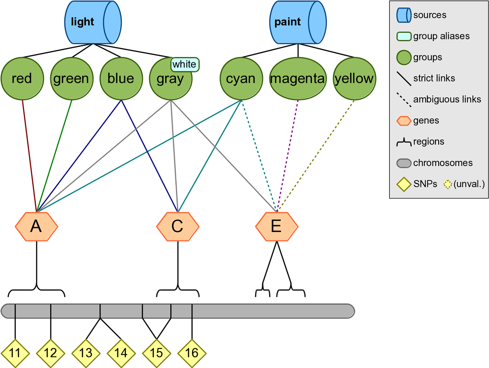
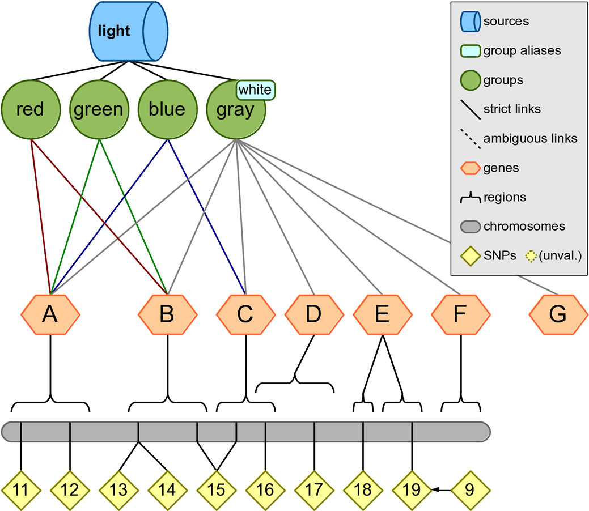

# Filtering Examples

## Example 1: Example 1: Filtering a list of SNPs by a genotyping platform, where input1 is the first list of SNPs and input2 is the list of SNPs on the genotyping platform

Input files:
```
input1  input2
#snp    #snp
rs9     rs14
rs11    rs15
rs12    rs16
rs13    rs17
rs14    rs18
rs15    rs19
rs16	
```

Configuration:
```
KNOWLEDGE test.db
SNP_FILE input1
SNP_FILE input2
FILTER snp
```

Output:
```
#snp
rs9
rs14
rs15
rs16
```
_Note_: The lists of input SNPs are checked against a dbSNP list of SNP ID’s that have been merged, and any outdated RSIDs are updated with the new RSID. In the example knowledge, rs9 has been merged into rs19; this is why rs9 appears in the output.

## Example 2: Output a list of SNPs from a genotyping platform that correspond to a list of genes



Input files:
```
input1      input2
#snp        #gene
rs11        A
rs12        C
rs13        E
rs14
rs15
rs16
```

Configuration:
```
KNOWLEDGE test.db
SNP_FILE input1
GENE_FILE input2
FILTER snp
```

Output:
```
#snp
rs11
rs12
rs15
rs16
```


## Example 3: Input a list of groups, output regions within those groups

Configuration:
```
KNOWLEDGE test.db
GROUP red green cyan magenta orange indigo
FILTER region
```

Output:
```
#chr    region  start   stop
1       A       8       22
1       B       28      52
1       C       54      62
3       P       14      18
3       Q       28      36
3       R       44      52
```

## Example 4: Output a list of all genes within a data source

Configuration:
```
KNOWLEDGE test.db
SOURCE light
FILTER gene

```

Output:
```
#gene
A
B
C
D
E
F
G

```

## Example 5: Start with a list of genes, output all the genes within particular groups



Input files:
```
input1      input2
#group      #gene
red         A
green       C
cyan        E
magenta     P
orange      R
indigo      
```

Configuration:
```
KNOWLEDGE test.db
GROUP_FILE input1
GENE_FILE  input2
FILTER region
```

Output:
```
#chr    region  start   stop
1       A       8       22
1       C       54      62
3       P       14      18
3       R       44      52
```

## Example 6: Start with genes associated with a pathway or group, output genes within that group that overlap with an input list of genes

Configuration:
```
KNOWLEDGE test.db
GENE P Q R
FILTER gene snp region group source

```

Output:
```
#gene   snp     chr     region  start   stop    group   source
Q       rs33    3       Q       28      36      orange  spectrum
Q       rs33    3       Q       28      36      indigo  spectrum
R       rs35    3       R       44      52      indigo  spectrum
R       rs35    3       R       44      52      indigo  spectrum
```

## Example 7: Starting with a list of genes, determine genes are within a group

Configuration:
```
KNOWLEDGE test.db
GENE A C E H P Q R
GROUP cyan
FILTER gene group
```

Output:
```
#gene   group
A       cyan
C       cyan
```
