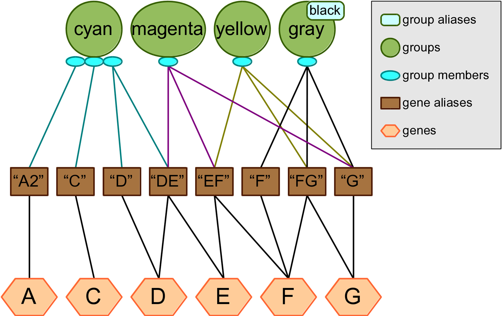
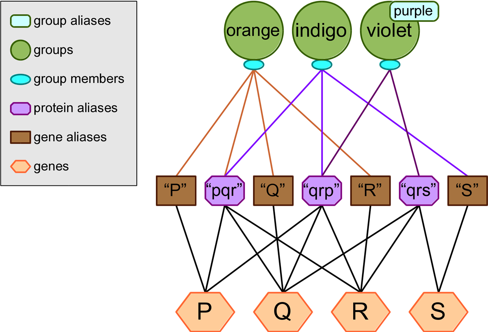

# Appendix 1: Ambiguity in Prior Knowledge

When an ambiguous gene or group identifier appears in a user input file, Biofilter has two straightforward options: either include all genes or groups with which the identifier is associated, or none of them.

When processing the bulk downloads from prior knowledge sources, however, the situation can become more complicated. This is due to the fact that in many cases, the data provided by a source is formatted in a way which allows multiple identifiers to be provided for the same member of a group. Ideally all such identifiers are known to refer to the same single gene, but occasionally this is not the case. Sometimes one of the identifiers is an alias of more than one gene, making it inherently ambiguous; other times, even if every identifier refers to only one gene, they might not all agree on which gene that is.

The testing knowledge included with Biofilter contains several examples of these kinds of situations, depicted in the diagram below. Note that this diagram reflects the fact that there may be multiple names for the same gene (i.e. “D” and “DE” both refer to gene D), and some names may be associated with multiple genes (i.e. “DE” refers to both genes D and E).

The “cyan” group contains three genes, of which the third is ambiguous because we are given two identifiers for it, but one of them refers to two different genes. The “magenta”, “yellow” and “gray/black” groups each contain only one gene, but in each case we are given three different names for that gene which agree or disagree with each other in varying ways. Because of the ambiguity in the provided identifiers, the genes which are considered members of these groups will appear to vary depending on the user’s choice for the ALLOW_AMBIGUOUS_KNOWLEDGE and REDUCE_AMBIGUOUS_KNOWLEDGE options.

## Ambiguity Reduction Heuristics

Biofilter and LOKI currently support two heuristic strategies for reducing ambiguity. These strategies make what is essentially an educated guess about what the original data source intended by the set of identifiers it provided. The first heuristic is called “implication” and it rates the likelihood of each potential gene being the intended one by counting the number of identifiers which implicate that gene. The second heuristic, called “quality,” is similar except that it also considers the number of genes that each identifier refers to as a measure of that identifier’s quality; a high-quality identifier (which refers to only one or two genes) is then given more weight than a low-quality identifier (which refers to many genes).

In practice, these two heuristic strategies will often produce the same results; in fact, when using real data from our real prior knowledge sources, we have yet to find a case where they do not reach the same conclusion. It is possible that such a case will arise in the future, however, so the “magenta”, “yellow” and “gray/black” groups in the testing knowledge have been specially crafted to highlight these potential differences.

## Ambiguity Options

The REDUCE_AMBIGUOUS_KNOWLEDGE option tells Biofilter which heuristics, if any, should be employed to mitigate ambiguity in the prior knowledge database. The permissible values for this option are the name of any of the heuristic strategies, or “no” or “any”. When set to “no” then no attempt is made to reduce ambiguity and all genes which are implicated by any of the provided identifiers are considered equally likely interpretations.  When set to “any” then all heuristics are attempted simultaneously and the winner(s) from each one collectively become the preferred choices.

The ALLOW_AMBIGUOUS_KNOWLEDGE option tells Biofilter what to do when it has more than one “best guess” interpretation for an ambiguous member of a group. If no heuristics were used then this occurs for all cases of ambiguity, but it should also be noted that any heuristic strategy might be only partly successful. For example, if a given set of identifiers collectively refer to three different genes and the heuristic(s) can only eliminate one of them, then the other two remain equally likely possibilities. In cases like this, the user’s choice for ALLOW_AMBIGUOUS_KNOWLEDGE determines the result: when disabled (the strict option) none of the possible genes will be considered a member of the group, but when enabled (the permissive option) the most-likely possibilities will all be included, without any of the less-likely possibilities.

## Gene Ambiguity Examples

### Example 1: cyan
The “cyan” group is a typical case of ambiguity which can be fully resolved by either of the heuristic strategies. Its first two members (genes A and C) are unambiguous and will always be included, but the correct third member of the group is open to interpretation.

The implication heuristic will declare D as the correct interpretation since it is implicated by both of the provided identifiers, while gene E is only implicated by one of them.

The quality heuristic will also choose D, but its reasoning is a little more involved. The “DE” identifier refers to two different genes, so it gets a quality score of 1/2 or 0.5; the “D” identifier, on the other hand, gets a quality score of 1 because it refers to only one gene. Gene E therefore receives only 0.5 points, while gene D wins with 1.5 total points.

Because the ambiguity can be fully resolved by either heuristic, the ALLOW_AMBIGUOUS_KNOWLEDGE option will only have an effect if no heuristics are used at all. In that case, the group will contain all four possible genes (A, C, D and E) if the option is enabled, but only A and C if it is disabled.

### Example 2: magenta
The “magenta” group demonstrates ambiguity which can only be resolved by the implication heuristic: gene E is implicated by two identifiers (“DE” and “EF”) while genes D, F and G are each only implicated by one identifier.

The quality heuristic will discard genes D and F (0.5 points each), but cannot pick a winner between E and G because they both have a score of 1.0: gene E gets 0.5 each from the “DE” and “EF” identifiers, while gene G gets 1 full point from “G”.

With no heuristics, the ALLOW_AMBIGUOUS_KNOWLEDGE option will either include all four genes or none of them. With the quality heuristic, it can either include both winners (E and G) or nothing. With the implication heuristic it has no effect here, since the ambiguity was eliminated with that strategy.

### Example 3: yellow
The “yellow” group demonstrates ambiguity which can only be resolved by the quality heuristic: gene G wins with a score of 1.5 (0.5 from “FG” plus 1.0 from “G”).

The implication heuristic will discard gene E (implicated by only one identifier), but cannot choose between F and G because they are implicated by two identifiers each: “EF and “FG”, or “FG and “G”.

With no heuristics, as always ALLOW_AMBIGUOUS_KNOWLEDGE will either include every possibility or none of them. With the implication heuristic it can either include both F and G or nothing, and with the quality heuristic it has no effect.

### Example 4: gray/black
The “gray/black” group is an example of ambiguity which cannot be resolved by either heuristic: genes F and G are entirely comparable, both being referenced by one specific identifier plus one (shared) ambiguous identifier. No matter which heuristic is used, if any, this group will always contain both F and G if ALLOW_AMBIGUOUS_KNOWLEDGE is enabled, or neither if it is disabled.

# Protein Identifiers

So far, our depiction of ambiguity in the knowledge database has implied that groups always contain genes. This allows for the convenient assumption that when we are given more than one identifier for something in a group, we are expecting all of those identifiers to refer to one (and only one) gene.

The reality is, of course, a little more complicated: some sources provide groups which actually contain proteins. In order to make this knowledge compatible with the rest of the prior knowledge, LOKI must translate these protein references into genes, but this breaks that convenient assumption. If a group contains genes then we can reasonably expect each member of the group to be a single gene, but if the group contains proteins, then we must be prepared for a single protein-member to correspond to many genes.
	
To account for this, LOKI differentiates between identifiers which refer directly to genes (such as symbolic abbreviations or Entrez Gene ID numbers) and identifiers which refer to proteins (such as UniProt ID numbers) that may in turn correspond to many genes.

If any of the identifiers provided for one member of a group is a protein identifier, LOKI disregards any non-protein identifiers. If there is only one protein identifier, then LOKI considers all genes which correspond to that protein to be members of the group, with no ambiguity. If there are multiple protein identifiers then there may be ambiguity if they do not correspond to the same set of genes.

Since protein identifiers are expected to correspond to multiple genes, the concept of an identifier’s “quality” no longer has meaning; consequently, whenever protein identifiers are involved, the implication and quality heuristic strategies become functionally equivalent. In both cases, a gene’s likelihood of being associated with a group is proportional to the number of protein identifiers which implicated it. When no heuristics are used, then all genes which are implicated by any of the protein identifiers are considered equally likely to belong in the group.

The testing knowledge included with Biofilter also contains several examples of groups with protein identifiers:

## Protein Ambiguity Examples

### Example 1: orange

The “orange” group contains a simple, unambiguous use of protein identifiers. No matter what options are used, this group will always contain the genes P, Q and R.

### Example 2: indigo

The “indigo” group demonstrates a more complicated but still unambiguous situation. The two protein identifiers agree with each other, so the group will always contain the genes P, Q and R no matter what options are used. However there is an extraneous gene identifier which is ignored, even though it does not appear to match the protein identifiers. In practice, this is rarely the case; when a source provides both protein and gene identifiers, the latter usually agree with the former.

### Example 3: violet

In the “violet” group the two protein identifiers only partly agree: both of them correspond to genes Q and R, but one of them also matches P while the other also matches S.

If ALLOW_AMBIGUOUS_KNOWLEDGE is enabled then all four genes will be included in the group. If it is disabled, then any heuristic strategy will include genes Q and R but not P or S. If no heuristics are used either, then the group will appear empty.

# Appendix 2: LD Profiles (TODO Deprecate?)

Each LD profile is defined by two things: a reference population whose particular LD patterns are relevant to the user’s analysis, and a threshold value to specify what the user considers “high LD.” Every LOKI knowledge database file begins with a default, unnamed LD profile which contains the canonical gene region boundaries and therefore has no reference population or LD threshold. All other LD profiles are calculated based on these original boundaries, which means whenever the LOKI knowledge database is updated, the LD profiles must also be re-calculated to incorporate any changes in the original gene region boundaries.

In order to generate LD profiles, Biofilter is distributed with a separate software tool called LD Spline. This tool can use specific LD measurements from the HapMap project to extrapolate more general LD patterns, which can in turn be used to calculate LD profiles containing adjusted gene region boundaries. More information about LD Spline is available from www.ritchielab.upenn.edu.

Installing LD Spline

LD Spline is written in C and must therefore be compiled for your local computing environment before it can be used. To do this automatically as part of the Biofilter installation process, simply use the “  ldprofile” option:

python setup.py install   ldprofile

This will compile and install the “ldspline” executable, along with a few supporting scripts which automate the process of generating and storing LD profiles in LOKI.
Generating LD Profiles

The LOKI prior knowledge database file must be generated before the LD adjustment can be done; refer to the Biofilter installation instructions for details on this procedure. Once the knowledge file is available, use the “buildPopulations.py” script to generate additional LD profiles. For example:

buildPopulations.py   db loki.db   populations CEU,YRI   dprime 0.6,0.7
  rsquared 0.8,0.9

This will generate 8 additional LD profiles for use in LOKI and Biofilter: four each for the CEU and YRI populations, of which two represent the LD pattern using D’ thresholds of 0.6 and 0.7 and the other two use the R2 metric with thresholds of 0.8 and 0.9. Note that building LD profiles may take quite some time; plan for at least 2 hours per population when run on a local disk, or twice that on a networked filesystem (such as GPFS). The build process also requires ~2 GB of RAM and some temporary disk space in the working directory: allow for 10 GB, plus another 10 GB per population.

With the modified knowledge database file, Biofilter can then make use of the alternate gene regions via the LD_PROFILE option:

biofilter.py   knowledge loki.db – ld-profile CEU-RS0.80
The “  report ld profiles” option can be used to list the LD profiles available in a LOKI database file:

biofilter.py   knowledge withld.db – report ld profiles

#ldprofile

CEU-DP0.60
CEU-DP0.70
CEU-RS0.80
CEU-RS0.90
YRI-DP0.60
YRI-DP0.70
YRI-RS0.80
YRI-RS0.90	description
no LD adjustment
CEU population from HapMap with dprime cutoff 0.6
CEU population from HapMap with dprime cutoff 0.7
CEU population from HapMap with rsquared cutoff 0.8
CEU population from HapMap with rsquared cutoff 0.9
YRI population from HapMap with dprime cutoff 0.6
YRI population from HapMap with dprime cutoff 0.7
YRI population from HapMap with rsquared cutoff 0.8
YRI population from HapMap with rsquared cutoff 0.9	metric

dprime
dprime
rsquared
rsquared
dprime
dprime
rsquared
rsquared	value

0.6
0.7
0.8
0.9
0.6
0.7
0.8
0.9
Population Build Script Options

--help
Displays the program usage and immediately exits.

  populations
A comma-separated list of 3-letter HapMap population identifiers (i.e. “CEU”, “JPT”, “YRI”, etc.)

  rsquared
A comma-separated list of R2 threshold values (between 0 and 1) for which to generate LD profiles.

  dprime
A comma-separated list of D’ threshold values (between 0 and 1) for which to generate LD profiles.

  liftover
The location of UCSC’s liftOver utility, which is needed to convert HapMap’s LD measurements to the current reference genome build. If omitted, liftOver must be available on the path.

  ldspline
The location of the LD Spline utility, which will be installed by the Biofilter installer if given the “  ldprofile” option. If omitted, ldspline must be available on the path.

  poploader
The location of the pop_loader helper script, which will be installed by the Biofilter installer if given the “  ldprofile” option. If omitted, pop_loader must be available on the path.

  db
The LOKI prior knowledge database file in which to generate LD-adjusted gene regions. The database must already contain the canonical gene regions.

  keep-data
Generating LD profiles requires many intermediate files such as original LD data from HapMap and extrapolated LD data from LD Spline. By default these intermediate files are deleted after use; if this option is specified, they will be left in place.

