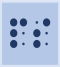
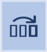
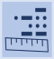
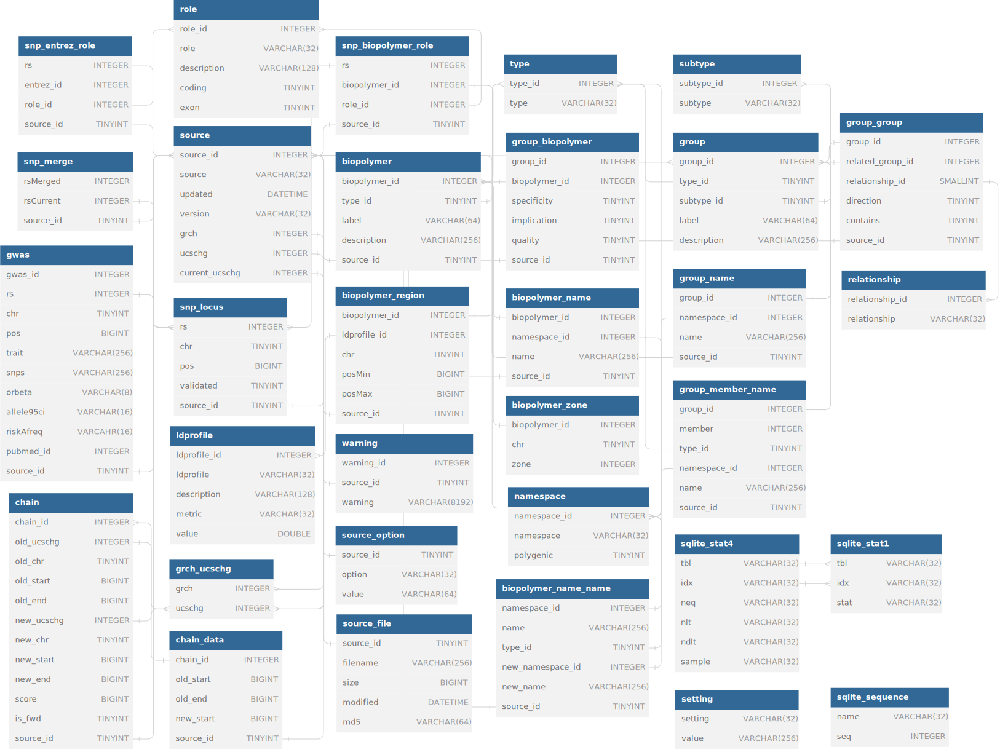

# Data Types

|Symbol|Data Type|Description|
|---|---|---|
|**SNP**||Specified by an RS number, i.e. “rs12345678”; Used to refer to a known and documented SNP whose position can be retrieved from LOKI|
|**Position**||Specified by a chromosome and basepair location, i.e. “chr1:234”; Used to refer to any single genomic location, such as a SNP, SNV, rare variant, or any other position of interest|
|**Region**||Specified by a chromosome and basepair range, i.e. “chr1:234-567”; Used to refer to any genomic region, such as CNV, insertion/deletion (indel), gene coding region, evolutionarily conserved region (ECR), functional region, regulatory region, or any other region of interest|
|**Gene**||Specified by a name or other identifier, i.e. “ABG1” or “ENSG00000123456”; used to refer to a known or documented gene, whose genomic region and associations with any pathways, interactions, or other groups can be retrieved from LOKI|
|**Group**||Specified by a name or other identified, i.e. “inflammatory process” or “GO:0001234”; Used to refer to known and documented pathway, protein families, ontological group, interaction pairs, or any groupings of genes, proteins, genomic regions, or diseases|
|**Source**||Specified by name, i.e. “GAAD” or “DisGeNET”; Used to refer to a specific external data source|

# LOKI Relational Data Schema
