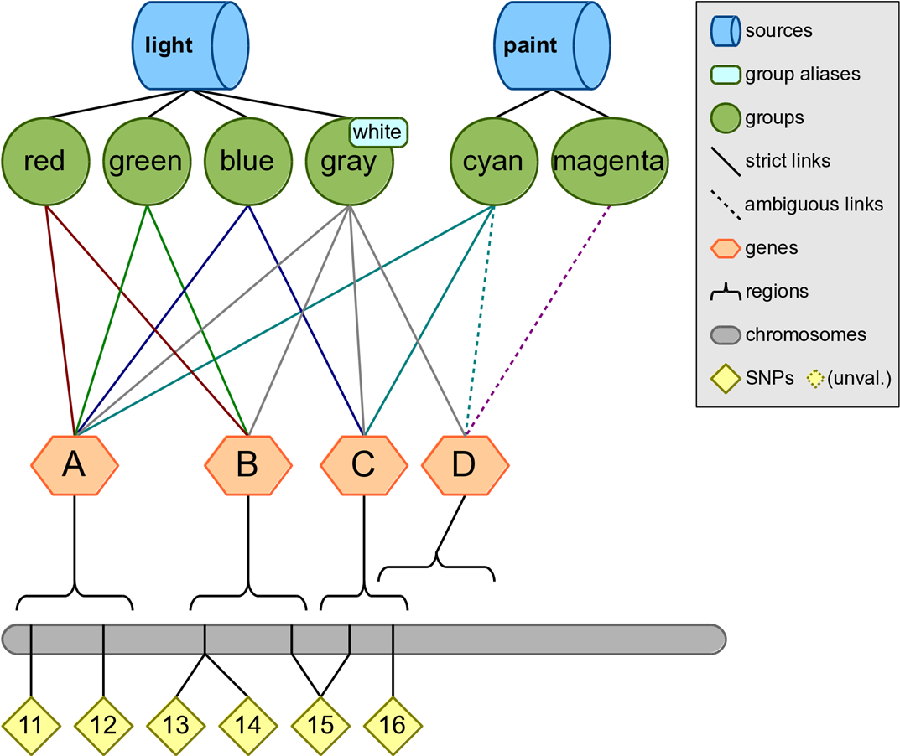
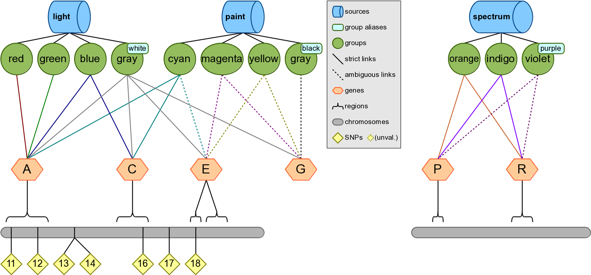

# Filtering Followed by Annotation Examples
## Example 1: Input a SNP list and Map SNP Positions to Regions



Configuration:
```
KNOWLEDGE test.db
SNP rs11 rs12 rs13 rs14 rs15 rs16
FILTER region
```

Output:
```
#chr    region  start   stop
1       A       8       22
1       B       28      52
1       C       54      62
1       D       58      72
```

## Example 2: Map SNPs to Groups and Filter on the Source
Configuration:
```
KNOWLEDGE test.db
SOURCE paint
FILTER snp group source
```

Output:
```
#snp    group   source
rs11    cyan    paint
rs12    cyan    paint
rs15    cyan    paint
rs16    cyan    paint
```

## Example 3: Testing Overlap of SNP and Region Lists, Outputting Regions
Input Files:

**Input 1**
```
#snp
rs14
rs15
rs16
rs17
rs18
rs19
```

**Input 2**
```
#chr    region  start   stop
1       A       8       22
1       B       28      52
1       C       54      62 
1       D       58      72
```

Configuration:
```
KNOWLEDGE test.db
SNP_FILE input1
REGION_FILE input2
FILTER region
```

Output:
```
#chr    region  start   stop
1       B       28      52
1       C       54      62
1       D       58      72
```

## Example 4: Testing Overlap of Gene and Source Lists, Outputting Regions
Configuration:
```
KNOWLEDGE test.db
GENE A C E G P R
SOURCE spectrum
FILTER region
```

Output:
```
#chr    region  start   stop
3       P       14      18
3       R       44      52
```

## Example 5: Filter Gene List Based on Sources, and Output Regions
Configuration:
```
KNOWLEDGE test.db
GENE A C E G P R
SOURCE paint spectrum
FILTER gene source region
```

Output:
```
#gene   source      chr region  start   stop
A       paint       1   A       8       22
C       paint       1   C       54      62
P       spectrum    3   P       14      18
R       spectrum    3   R       44      52    
```

## Example 6: Output of Genes Found in Pathway-Based Input, Filtered by Genotyping Platform
Configuration:
```
KNOWLEDGE test.db
SNP rs11 rs12 rs13 rs14
GENE A C E G P R
GROUP cyan yellow
FILTER region
```

Output:
```
#chr    region  start   stop
1       A       8       22
```

## Example 7: Output of Genes Annotated by Group found in Pathway-Based Input, Filtered by Genotyping Platform



Configuration:
```
KNOWLEDGE test.db
SNP rs11 rs12 rs13 rs14 rs16 rs17 rs18
GENE A C E G P R
GROUP cyan yellow
FILTER gene group
```

Output:
```
#gene   group
A       cyan
C       cyan
```

## Example 8: Genes Within Data Sources from List of Input Genes Filtered by GenotypingPplatform, Output Regions
Configuration:
```
KNOWLEDGE test.db
SNP rs11 rs12 rs13 rs14 rs16 rs17 rs18
GENE A C E G P R
SOURCE paint spectrum
FILTER region
```

Output:
```
#chr    region  start   stop
1       A       8       22
1       C       54      62
```

## Example 9: Find Overlap Between 2 SNP Lists and Map the Overlapping SNPs to Genes
Input Files:
**Input 1**
```
#snp
rs11
rs12
rs13
rs14
rs15
rs16
```

**Input 2**
```
#snp
rs14
rs15
rs16
rs17
rs18
rs19
```

Configuration:
```
KNOWLEDGE test.db
SNP_FILE input1
SNP_FILE input2
FILTER snp gene region
```

Output:
```
#snp    gene    chr region  start   stop
rs14    B       1   B       28      52
rs15    B       1   B       28      52
rs15    C       1   C       54      62
rs16    C       1   C       54      62
rs16    D       1   D       58      72
```

## Example 10: Find Overlapping SNPs Between 2 Lists and Map the Overlapping SNPs to Genes, Regions, Groups and Sources
Configuration:
```
KNOWLEDGE test.db
SNP rs11 rs12 rs13 rs14 rs15 rs16
SNP rs14 rs15 rs16 rs17 rs18 rs19
FILTER snp gene region group source
```

Output:
```
#snp    gene    chr     region  start   stop    group   source
rs14    B       1       B       28      52      red     light
rs14    B       1       B       28      52      green   light
rs14    B       1       B       28      52      gray    light
rs15    B       1       B       28      52      red     light
rs15    B       1       B       28      52      gray    light
rs15    C       1       C       28      62      blue    light
rs15    C       1       C       28      62      gray    light
rs15    C       1       C       28      62      cyan    paint
rs16    C       1       C       28      62      blue    light
rs16    C       1       C       28      62      gray    light
rs16    C       1       C       28      62      cyan    paint
rs16    D       1       D       58      72      gray    light
```

## Example 11: Mapping Regions to Genes using Biofilter Based on Percent of Overlap
Regions such as copy number variations can be mapped to genes using Biofilter, carried out based on percent of overlap of the genes with the CNV region or based on the number of base pairs overlapped. 

For reference, here are the boundary positions for the genes in chromosome 1:
```
#chr    gene    start   stop
1       A       8       22
1       B       28      54
1       C       54      62
1       D       58      72
1       E       78      82
1       E       84      92
1       F       94      98
```

Configuration:
```
KNOWLEDGE test.db
REGION 1:1:60
REGION_MATCH_PERCENT 50
FILTER gene
```

Output:
```
#gene
A
B
C
```

This output indicates that at least 50% of genes A, B, and C fall within the first 60 bases of the first chromosome. Both genes A and B match 100% of the region while gene C matches 75%.

## Example 12: Mapping Regions to Genes Using Biofilter Based on Base Pair Overlap
The genes overlapping region based on number of base-pair overlap can also be determined via Biofilter.

Configuration:
```
KNOWLEDGE test.db
REGION 1:1:60
REGION_MATCH_BASES 10
FILTER gene
```

Output:
```
#gene
A
B
```

This output uses the region-match-bases argument to specify that Biofilter should filter genes that only match a minimum of 10 bases within the given input region.

## Example 13: Annotating a List of Gene Symbols with SNPs, Regions, Groups, and Sources, using Biofilter
Configuration:
```
KNOWLEDGE test.db
GENE A B C D E
FILTER gene snp region group source
```

Output:
```
#gene   snp     chr     region  start   stop    group   source
A       rs11    1       A       8       22      red     light
A       rs11    1       A       8       22      green   light
A       rs11    1       A       8       22      blue    light
A       rs11    1       A       8       22      gray    light
A       rs11    1       A       8       22      cyan    paint
A       rs12    1       A       8       22      red     light
A       rs12    1       A       8       22      green   light
A       rs12    1       A       8       22      blue    light
A       rs12    1       A       8       22      gray    light
A       rs12    1       A       8       22      cyan    paint
B       rs13    1       B       28      52      red     light
B       rs13    1       B       28      52      green   light
B       rs13    1       B       28      52      gray    light
B       rs14    1       B       28      52      red     light
B       rs14    1       B       28      52      green   light
B       rs14    1       B       28      52      gray    light
B       rs15    1       B       28      52      red     light
B       rs15    1       B       28      52      green   light
B       rs15    1       B       28      52      gray    light
C       rs15    1       C       54      62      blue    light
C       rs15    1       C       54      62      gray    light
C       rs15    1       C       54      62      cyan    paint
C       rs16    1       C       54      62      blue    light
C       rs16    1       C       54      62      gray    light
C       rs16    1       C       54      62      cyan    paint
D       rs16    1       D       58      72      gray    light
D       rs17    1       D       58      72      gray    light
E       rs18    1       E       78      82      gray    light
E       rs19    1       E       84      92      gray    light
```