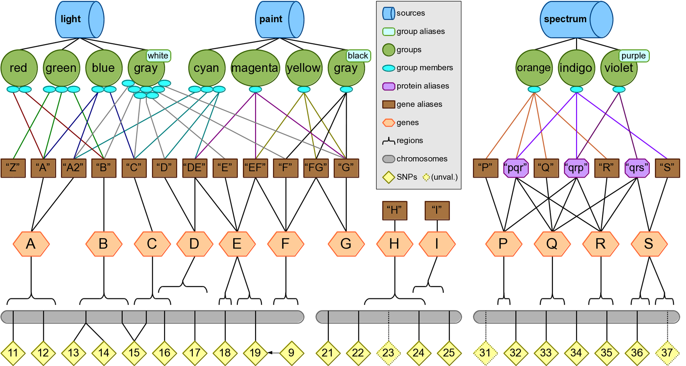
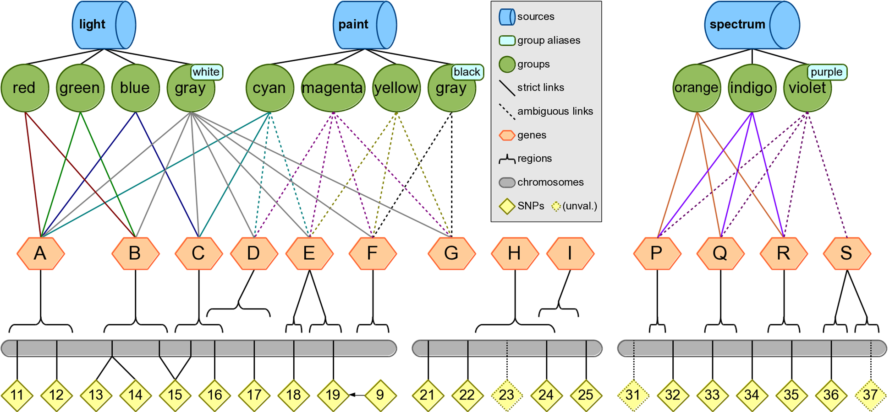

# Simulated Data Examples

## Example Knowledge
In order to provide examples of filtering, annotation, and model building commands for Biofilter 2.0, we have provided a simulated LOKI database. This simulated database contains three fictitious sources (named “light”, “paint” and “spectrum”) which define eleven pathways (named “red”, “green”, “blue”, “gray”, “cyan”, “magenta”, “yellow”, “gray”, “orange”, “indigo”, “violet”), linked to 13 genes and 21 SNPs.

This simulated knowledge is intended to provide easily-understood examples of Biofilter’s functionality without relying on real-world cases which might become outdated. Many important concepts and edge cases are represented here, such as two groups with the same primary label (“gray”) which can only be differentiated by their aliases (“white” and “black”), some genes with multiple aliases (i.e. “A” and “A2”), and some aliases referring to multiple genes (i.e. “DE” could be gene D or gene E).

The groups from the “paint” and “spectrum” sources demonstrate many varieties of ambiguity. These are discussed in depth in Appendix 1, but for the examples in this chapter we will assume strict ambiguity options. We can then simplify the diagram of the knowledge by showing associations between groups and genes without the messy intermediate layer of aliases; in the resulting diagram below, the dotted lines indicate associations which will be ignored by default, but may appear if the ambiguity settings are changed.

In order to reproduce the following examples using your own copy of Biofilter, you must run the “loki build.py” script using the “  test data” option; refer to the Installation & Setup section for details.